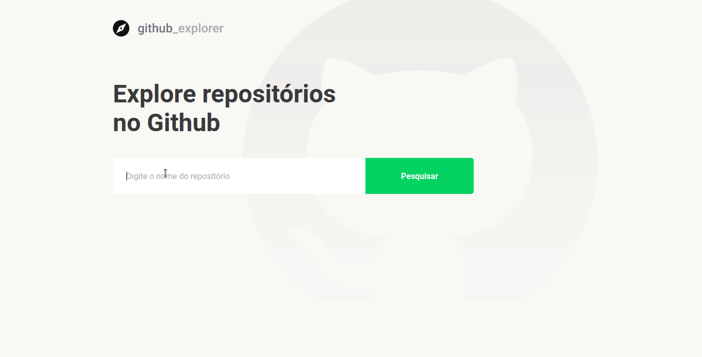

<h1 align="center">Gitub Explorer 🧭</h1>
<p align="center">

</P>
<p>
  
  <a href="#" target="_blank">
    
  </a>
</p>


### ✨ [Demo](https://githubexplorer-gostack.netlify.app)

## Install

```sh
yarn install
```

## Usage

```sh
yarn start
```

## Run tests

```sh
yarn run test
```

## Author

👤 **Matheus Santos <matheussm301@gmail.com>**

* Website: https://matheussantosdev.com
* Github: [@matheus-santos-moreira](https://github.com/matheus-santos-moreira)
